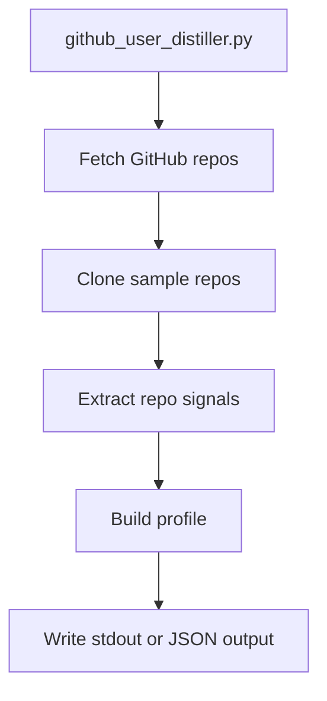

# GitHub user distiller

A small Python project for distilling a GitHub user's public repositories into a concise profile.

## Overview

The current workflow uses a single script, [github_user_distiller.py](github_user_distiller.py), which:

1. Fetches a GitHub user's public repositories.
2. Clones a small sample of them into a temporary directory.
3. Extracts lightweight signals from README files, manifests, and source file types.
4. Produces a profile using the GitHub Copilot SDK when available, with a heuristic fallback otherwise.

## Prerequisites

- Python 3.10+
- Git
- A GitHub Copilot CLI installation that is authenticated for the current user

The Copilot CLI must be installed and signed in before the SDK-backed path can work.

## Windows setup

Create and activate a virtual environment:

```powershell
py -3 -m venv .venv
.\.venv\Scripts\Activate.ps1
```

Install dependencies:

```powershell
pip install -r requirements.txt
```

If you do not yet have a requirements file, install the SDK directly:

```powershell
pip install github-copilot-sdk
```

## Default command behavior

Run the distiller with a GitHub username:

```powershell
.\.venv\Scripts\python.exe .\github_user_distiller.py octocat
```

Default behavior:

- analyzes up to 5 repositories
- writes output to stdout
- does not write a JSON file unless requested

## Flags

```powershell
.\.venv\Scripts\python.exe .\github_user_distiller.py USERNAME [options]
```

Available flags:

- `--max-repos N`: limit the number of repositories to inspect (default: `5`)
- `--output PATH`: write the JSON result to the given file
- `--model MODEL`: optionally request a specific Copilot model name; if the model is unavailable, the script falls back to the runtime default

Example:

```powershell
.\.venv\Scripts\python.exe .\github_user_distiller.py octocat --max-repos 2 --output profile.json
```

## Copilot CLI note

The script can work in heuristic mode without the Copilot SDK being fully available, but the richer Copilot-backed profile path requires:

- the Copilot CLI to be installed
- the CLI to be authenticated for the current environment/user

If the CLI is missing or not authenticated, the script will still run and produce a heuristic profile.

## Project structure



## Future direction

This repository is currently focused on the Windows workflow. The design is intended to be portable in future iterations, but the current commands and setup target Windows first.
